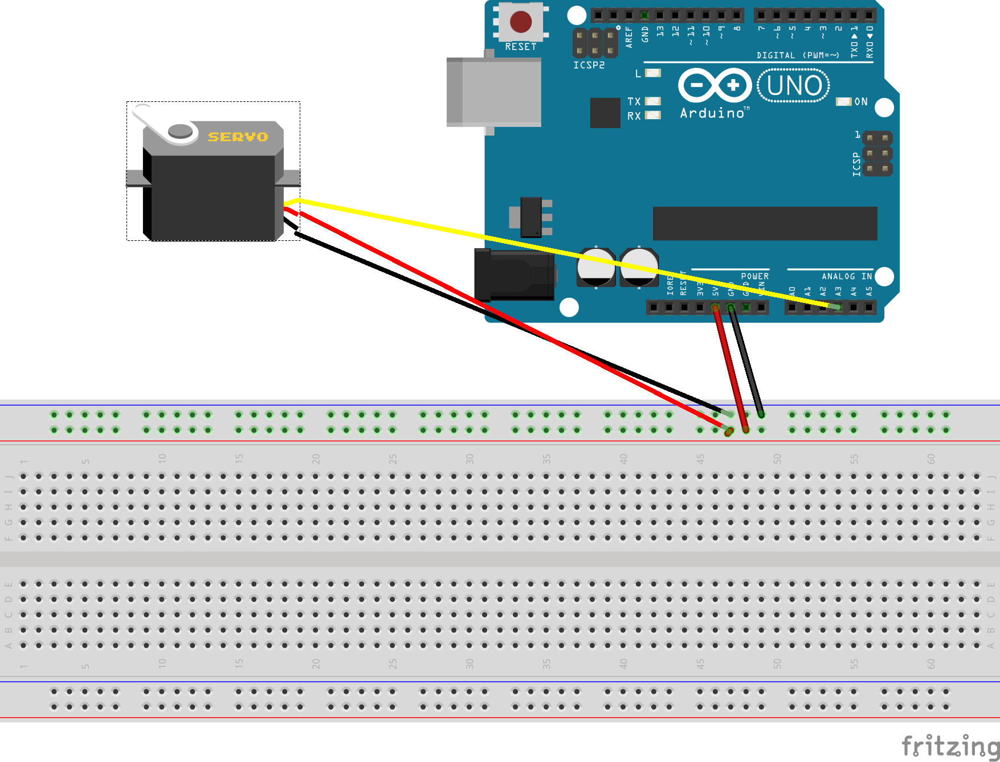
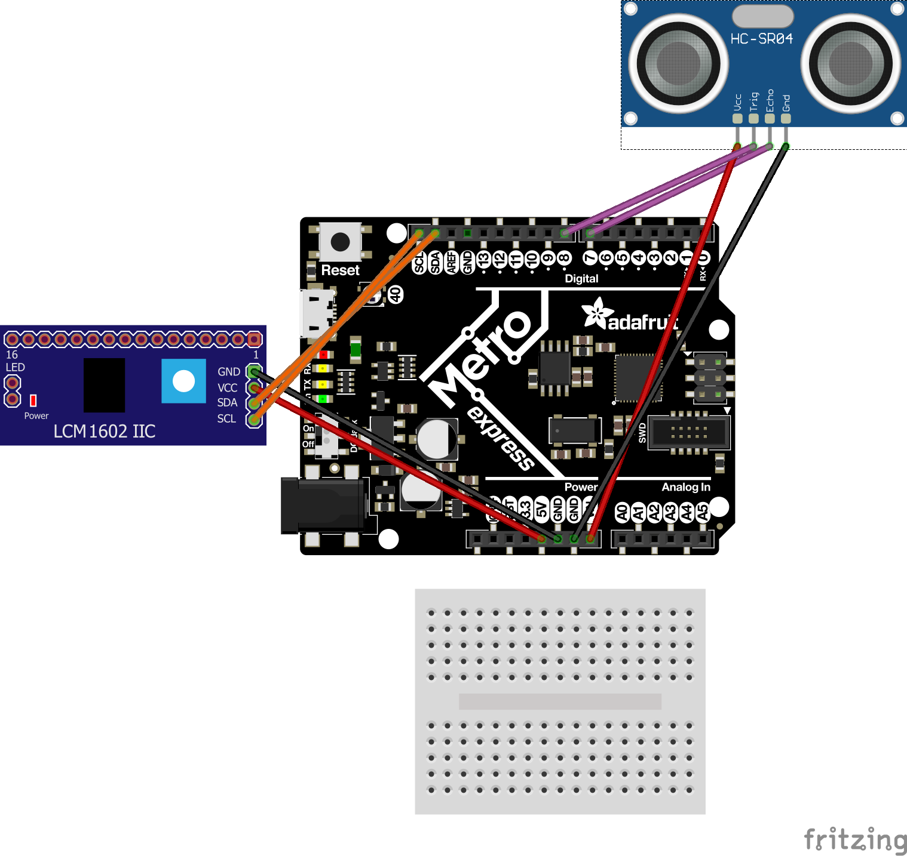

# CircuitPython
My CircuitPython assignments

# Servo
Description:
- In this assignment I hade to make a servo rotate both clockwise and counter-clockwise (left,right) when one or two wires are touched.

Lessson learned:
- whilst doing this assignement, one thing i learned is that CircuitPython is going to take getting used too.

Fritzing:

# Ultrasonic Sensor
Description:
- In this assignment, I had to wire up an LED so it would blink in varios colors according to the Ultrasonic Sensor
Lessson learned:
- One thing i learned was, when using neopixel on CircuitPython, you can make it glow any color just by typing in the set of 3 Numbers that color has.

Fritzing:

# LcdScreen
Description:
- in this assignment I had to make an LcdScreen print how many times a button was pushed, add a switch so when u flip it,it could go from 0 and up when the button is pushed or vise-versa.
Lessson learned:
- One thing I learned was, when you need to use an LcdScreen its eaiser to use the backpack attachment.

Fritzing:

# LedFade
Description:
- in this assignment , just like last year, we simply just have to make an led fade in and out.
Lessson learned:
-i learned that most of the assignments we did on the arduino last year are kinda the same as circuitpython.

Fritzing:

# PhotoInterrupter
Description:
- in this assignment i hade to make the serial moniter print how many times the current passing through the interrupter was interrupted
Lessson learned:
- i learned that even if your wiring is wrong and your code is right the interrupter will still get interrupted and print numbers but they wont coordinate with how many times youve interrupted it.

Fritzing:
# RGB Led
Description:
- in this assignment i hade to make a class that would work with the coorisponding code and make the RGB Leds blink with the color designated to it.
Lessson learned:
- I learned that when creating classes for CircuitPython it is very hard and very tuough to do espesially when u have to go from the finish to the beginning.

Fritzing:

# VS Code
Description:
-  in this assignment i was supposed to run some code on a new application and see if it printed what i wanted it to , to the serial moniter.
Lessson learned:
-

Fritzing:

-I learned how to use VS Code and upload code to Git directly from the application (not using GitBash)
